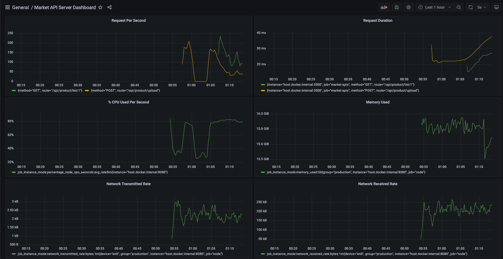

# market-project

## Overall
This repo demostrates basic api which supports upload and get products in online markert. This also includes functional test to make sure code work properly and visualize trafic through prometheus + grafana 

## Run demo
1. Run script: ***start_environments.sh*** to start environments
2. Run script: ***start_api_test.sh*** to start api
  
## Testing
You can see scenarios I prepared in folder: **functional_test/features/marketAPIFeature**:


Then, you execute script: ***start_test_api.sh*** to check the APIs with testcases composed.

The results:


## Performance Testing
You also check performance of API by using **hey** commandline:

Create **100000 GET requests** to get detail one product:

```sh
hey -n 100000 -c 4 -q 200 http://localhost:3500/api/product/list/1
```

Create **100000 POST requests** to upload new product

```sh
hey -n 100000 -c 4 -q 200 -m POST -T "application/json"  -d '{"name":"Ram DDR4 P2666 Gigabyte","quantity":10,"unit":"peace","price":20,"price_unit":"dollar","user_id":10,"company_id":1}' http://localhost:3500/api/product/upload
```

## Tracking traffic by Grafana
You can setup charts in grafana on host: _http://localhost:3000_

Using query: `sum(rate(myapp_request_total{}[1m])) by (method,path)` to show number requests per second Graph or imporing grafana schema saved in `./docker_environments/grafana/grafanaSetting.json`

Connect to Prometheus


Setup query in grafana and view chart



